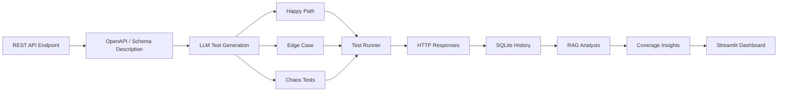

<h1 align="center">🛡️ ShadowQA</h1>

<p align="center">
<b>AI-Powered API Testing & Debugging Framework</b>
</p>

<p align="center">
Generate intelligent API test cases from OpenAPI specifications, execute them against REST endpoints, and analyze failures using Retrieval-Augmented Generation (RAG).
</p>

<p align="center">

<a href="https://shadowapp.streamlit.app">

</a>

<a href="https://github.com/RythmaLakkady/ShadowQA">

</a>


</p>

---

# Overview

ShadowQA is an AI-powered API testing framework that generates structured test cases from API specifications, executes them against REST endpoints, and assists debugging through Retrieval-Augmented Generation (RAG).

Instead of manually writing repetitive test cases, users provide an API endpoint, HTTP method, and a natural language description of the request schema. ShadowQA uses a Large Language Model (LLM) to generate structured **Happy Path**, **Edge Case**, and **Chaos** test cases, executes them against the target API, and presents the results through an interactive Streamlit dashboard.

To assist with debugging, ShadowQA incorporates **Retrieval-Augmented Generation (RAG)** to analyze historical failures and provide contextual explanations that help developers understand potential causes of API errors.

The project was built to explore how Large Language Models can support API testing workflows while reducing manual effort and improving visibility into API behavior.

---

## Why ShadowQA?

Testing APIs often involves writing repetitive test cases, manually validating responses, and debugging failures across multiple tools.

ShadowQA brings these tasks together into a single workflow by combining AI-generated test cases, automated execution, historical audit tracking, and RAG-assisted failure analysis.

---

# Features

| Feature | Description |
|----------|-------------|
| 🤖 **AI Test Generation** | Generates structured Happy Path, Edge Case, and Chaos test cases from API specifications. |
| ⚡ **Automated Test Execution** | Executes generated test cases against REST endpoints and records latency and status codes. |
| 🧠 **RAG-assisted Failure Analysis** | Uses LangChain and ChromaDB to analyze historical failures and provide contextual explanations. |
| 📊 **Coverage Analysis** | Tracks tested endpoints and highlights potential coverage gaps. |
| 📁 **Historical Audits** | Stores previous executions using SQLite for later review and comparison. |
| 🔐 **User Authentication** | Supports authenticated access with credential storage for user accounts. |
| 🖥️ **Interactive Dashboard** | Streamlit-based interface for generating, executing, and reviewing API tests. |

---
# 🏗️ System Architecture



---

# 🚀 How ShadowQA Works

1. **Provide API Details**
   - Enter the target REST endpoint.
   - Select the HTTP method.
   - Describe the expected request schema.

2. **Generate AI Test Cases**
   - The LLM creates structured Happy Path, Edge Case, and Chaos test cases.

3. **Execute Tests**
   - ShadowQA sends generated requests to the target API and records response metadata.

4. **Analyze Results**
   - Response status codes, latency, and execution details are stored in SQLite.

5. **Review Insights**
   - Historical executions are retrieved through the RAG pipeline to provide contextual failure analysis and endpoint coverage information.

---

# 📂 Project Structure

```text
ShadowQA
│
├── app.py
│
├── core/
│   ├── llm_engine.py
│   ├── rag_engine.py
│   ├── test_runner.py
│   └── coverage.py
│
├── database/
│   └── db.py
│
├── ui/
│   ├── auth.py
│   ├── components.py
│   └── tabs.py
│
├── requirements.txt
├── .env.example
└── README.md
```

---

# 🛠️ Tech Stack

| Category | Technologies |
|-----------|--------------|
| **Language** | Python |
| **Frontend** | Streamlit |
| **LLM** | Groq (Llama 3.3 70B) |
| **AI Framework** | LangChain |
| **Vector Database** | ChromaDB |
| **Database** | SQLite |
| **Networking** | httpx |
| **Environment** | python-dotenv |

---

# ⚙️ Installation

## Prerequisites

Before running ShadowQA, ensure you have:

- Python **3.8+**
- A **Groq API Key**
- Internet connection (for LLM inference)

---

## Clone the Repository

```bash
git clone https://github.com/RythmaLakkady/ShadowQA.git
cd ShadowQA
```

---

## Install Dependencies

```bash
pip install -r requirements.txt
```

---

## Configure Environment Variables

Create a `.env` file in the project root.

```env
GROQ_API_KEY=your_groq_api_key
```

Get your API key from:

https://console.groq.com

---

## Launch ShadowQA

```bash
streamlit run app.py
```

Open:

```
http://localhost:8501
```

---

## Quick Start

1. Configure your Groq API key.

2. Launch ShadowQA.

3. Enter an endpoint, HTTP method, and request schema.

4. Generate AI-powered test cases.

5. Execute the generated requests.

6. Review execution metrics and RAG-assisted analysis.

Example:

```
POST /users

Accepts:
- name (string)
- email (string)
- age (integer)
```

5. Generate AI-powered test cases.

6. Execute the generated tests.

7. Review execution metrics, historical audits, coverage information, and RAG-assisted analysis.

---

# 📖 Usage Guide

## 1️⃣ Generate Test Cases

Provide:

- API Endpoint
- HTTP Method
- Request Schema

ShadowQA automatically generates three categories of test cases:

- ✅ Happy Path
- ⚠️ Edge Case
- 💥 Chaos

---

## 2️⃣ Execute Tests

Generated requests are executed against the selected endpoint.

For each request ShadowQA records:

- HTTP Status Code
- Response Time
- Pass / Fail Status
- Execution Metadata

---

## 3️⃣ Analyze Results

Executed tests are stored in SQLite for later analysis.

Historical executions can be revisited to:

- Compare previous runs
- Review failed requests
- Track endpoint coverage
- Analyze recurring issues

---

## 4️⃣ RAG-Assisted Analysis

The RAG pipeline retrieves relevant historical execution data and provides contextual explanations for previous failures, helping developers better understand recurring issues during API testing.

---

# 💡 Example Workflow

```text
Target Endpoint
       │
       ▼
Describe API Schema
       │
       ▼
Generate Test Cases
       │
       ▼
Execute Requests
       │
       ▼
Collect Responses
       │
       ▼
Store Results
(SQLite)
       │
       ▼
RAG Analysis
       │
       ▼
Coverage Dashboard
```

---

# 🗺️ Roadmap

The following features are planned for future releases.

### Testing Engine

- [ ] Asynchronous test execution
- [ ] Configurable concurrency limits
- [ ] Retry & exponential backoff
- [ ] Response body validation
- [ ] Custom test templates

---

### AI & Analysis

- [ ] Multi-LLM support (OpenAI, Anthropic, Local Models)
- [ ] Improved vulnerability classification
- [ ] Enhanced RAG retrieval pipeline
- [ ] Response similarity detection
- [ ] Automatic report summarization

---

### Platform

- [ ] Docker support
- [ ] GitHub Actions CI/CD
- [ ] PostgreSQL support
- [ ] Report export (PDF / Excel)
- [ ] Webhook integrations

---

# ⚠️ Current Limitations

ShadowQA is an active project and continues to evolve.

Current limitations include:

- Sequential test execution
- Vulnerability detection primarily based on response metadata and status codes
- Groq is currently the only supported LLM provider
- Limited response body analysis
- SQLite-based local storage
- Designed for development and testing environments

---

# 🤝 Contributing

Contributions, suggestions, and feedback are always welcome.

If you'd like to contribute:

1. Fork the repository.
2. Create a feature branch.
3. Commit your changes.
4. Open a Pull Request.

For major feature proposals, please open an Issue first to discuss the design.

---

# 📄 License

This project is licensed under the **MIT License**.

---

<p align="center">

⭐ If you found this project useful, consider giving it a star.

</p>
