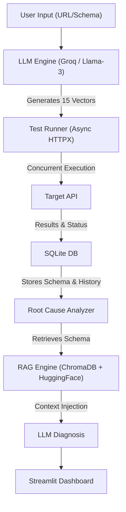

<h1 align="center">🛡️ ShadowQA</h1>

<p align="center">
<b>AI-Powered API Testing & Debugging Framework</b>
</p>

<p align="center">
Generate intelligent API test cases from OpenAPI specifications, execute them concurrently against REST endpoints, and analyze failures using Retrieval-Augmented Generation (RAG).
</p>

<p align="center">

<a href="https://shadowqa-agent.streamlit.app">

</a>

<a href="https://github.com/RythmaLakkady/ShadowQA">

</a>

<br>


</p>

---

# Overview

ShadowQA completely automates API testing by using AI to dynamically generate intelligent test vectors, execute them concurrently, and automatically diagnose the root causes of failures against your OpenAPI schema.

Instead of manually writing repetitive test cases, users provide an API endpoint, HTTP method, and a natural language description of the request schema. ShadowQA uses **Llama-3.3-70b (via Groq)** to generate structured **Happy Path**, **Edge Case**, and **Chaos** test cases, executes them concurrently using `httpx`, and presents the results through an interactive Streamlit dashboard.

To assist with debugging, ShadowQA incorporates **Retrieval-Augmented Generation (RAG)** to index your OpenAPI schema locally, fetch historical failure data, and provide contextual explanations that help developers pinpoint exact causes of API errors.

---

## Why ShadowQA?

ShadowQA eliminates brittle, manual QA scripts by combining high-throughput LLM payload generation with a local RAG engine that cross-references your exact OpenAPI schema to instantly diagnose why an API failed.

---

# Features

| Feature | Description |
|----------|-------------|
| 🏠 **Workspace Management** | Passwordless "Active Operator Workspace" allows seamless user session tracking. |
| 🤖 **AI Test Generation** | Generates 15 diverse structured Happy Path, Edge Case, and Chaos test vectors in < 2 seconds. |
| ⚡ **Concurrent Execution** | Asynchronously executes all generated payloads concurrently using `httpx` for maximum speed. |
| 🧠 **RAG Root Cause Analyzer** | Uses HuggingFace embeddings and ChromaDB to analyze historical failures against your OpenAPI schema automatically. |
| 🕵️‍♂️ **Coverage Analyzer** | Parses Postman Collections and compares them against OpenAPI specs to map out untested "Shadow Zones". |
| 📊 **History & Audits** | Fully color-coded dashboard tracking previous executions, test latency, and vulnerability classifications using SQLite. |

---
# 🏗️ System Architecture


```mermaid
flowchart TD

A["User Input (URL/Schema)"] --> B["LLM Engine (Groq / Llama-3)"]
B --> |Generates 15 Vectors| C["Test Runner (Async HTTPX)"]
C --> |Concurrent Execution| D["Target API"]
D --> |Results & Status| E["SQLite DB"]
E --> |Stores Schema & History| F["Root Cause Analyzer"]
F --> |Retrieves Schema| G["RAG Engine (ChromaDB + HuggingFace)"]
G --> |Context Injection| H["LLM Diagnosis"]
H --> I["Streamlit Dashboard"]
```

---

# 🚀 How ShadowQA Works

1. **Provide API Details (Chaos Console)**
   - Enter the target REST endpoint.
   - Select the HTTP method.
   - Describe the expected request schema.

2. **Generate AI Test Cases**
   - The LLM creates structured Happy Path, Edge Case, and Chaos test cases.

3. **Execute Tests**
   - ShadowQA sends generated requests concurrently to the target API and records response metadata.

4. **Analyze Results & Track History**
   - Response status codes, latency, schemas, and execution details are stored in SQLite and can be viewed in the **History & Audits** tab.

5. **Root Cause Analysis**
   - Failed tests can be selected from the global history dropdown. ShadowQA automatically retrieves the schema, indexes it, and uses RAG to provide contextual failure analysis.

---

# 📂 Project Structure

```text
ShadowQA
│
├── app.py                     # Main Streamlit Router and Setup
│
├── core/
│   ├── llm_engine.py          # Groq integration & prompt logic
│   ├── rag_engine.py          # ChromaDB, Chunking, and Root Cause AI
│   ├── test_runner.py         # Async httpx execution and vulnerability mapping
│   └── coverage.py            # Postman & OpenAPI parsing
│
├── database/
│   └── db.py                  # SQLite configuration and history tracking
│
├── ui/
│   ├── components.py          # Reusable Streamlit UI components
│   └── tabs.py                # Core page renders (Home, Chaos, Analyzer, etc.)
│
├── requirements.txt
├── .env.example
└── README.md
```

---

# 🛠️ Tech Stack

| Category | Technologies |
|-----------|--------------|
| **Language** | Python |
| **Frontend** | Streamlit |
| **LLM** | Groq (Llama 3.3 70B) |
| **AI Framework** | LangChain Community |
| **Embeddings** | HuggingFace (`all-MiniLM-L6-v2`) |
| **Vector Database** | ChromaDB |
| **Relational DB** | SQLite |
| **Networking** | httpx (AsyncClient) |

---

# ⚙️ Installation

## Prerequisites

Before running ShadowQA, ensure you have:

- Python **3.8+**
- A **Groq API Key**
- Internet connection (for LLM inference)

---

## Clone the Repository

```bash
git clone https://github.com/RythmaLakkady/ShadowQA.git
cd ShadowQA
```

---

## Install Dependencies

```bash
pip install -r requirements.txt
```

---

## Configure Environment Variables

Create a `.env` file in the project root.

```env
GROQ_API_KEY=your_groq_api_key
```

Get your API key from:
https://console.groq.com

---

## Launch ShadowQA

```bash
python -m streamlit run app.py
```

Open `http://localhost:8501` in your browser.

---

# 🗺️ Future Roadmap

- [ ] **CI/CD integration** (Running ShadowQA headless via GitHub Actions on PRs)
- [ ] **Security scanning** (Expanding the Chaos Path to explicitly check for OWASP Top 10)
- [ ] **Docker** (Containerizing the ChromaDB and Streamlit environment for enterprise deployment)

---

# 🤝 Contributing

Contributions, suggestions, and feedback are always welcome.

If you'd like to contribute:

1. Fork the repository.
2. Create a feature branch.
3. Commit your changes.
4. Open a Pull Request.

---

# 📄 License

This project is licensed under the **MIT License**.
